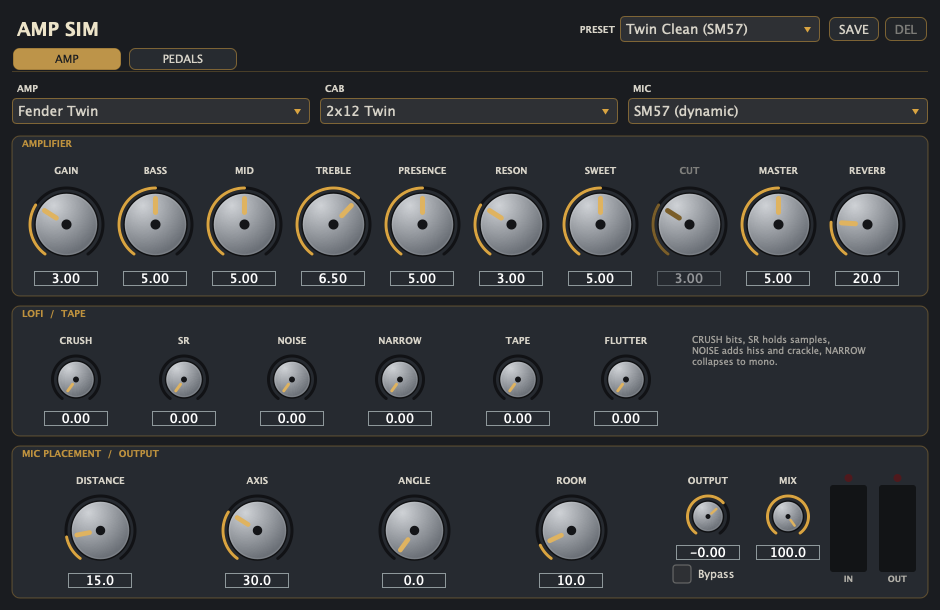
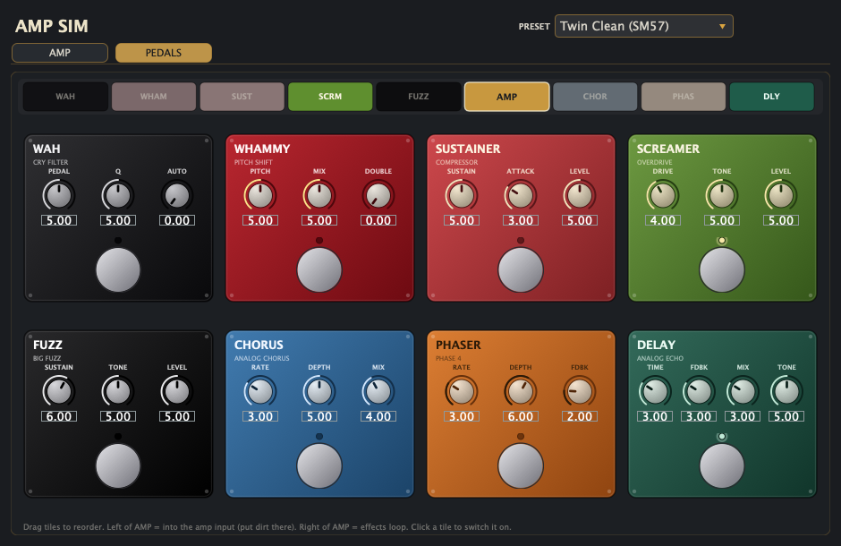

# Amp Sim

An amp simulator, pedalboard and colour box in one plugin — **AU + VST3 +
Standalone**, macOS, built with JUCE and CMake.

Guitar, bass and acoustic amps with freely mix-and-match **amp / cab / mic** and
continuous mic placement; eight pedals on a chain you can drag into any order,
with the amp itself as one of the draggable items; and a line path with tape and
lofi colour for using the whole thing on a bus or a master.

Everything is a **parametric model** — analytical filters and waveshapers, no
impulse responses and no sample libraries — so the plugin is self-contained and
every control is continuous.





## Install

Grab the zip from [Releases](../../releases), then:

1. Drag `Amp Sim.vst3` into `~/Library/Audio/Plug-Ins/VST3` (and/or
   `Amp Sim.component` into `~/Library/Audio/Plug-Ins/Components` for the AU).
2. **Clear the quarantine flag.** Release builds are not signed with a paid
   Apple Developer certificate, so macOS blocks them — and for plug-ins the
   "Open Anyway" button in System Settings usually never appears, because a
   plug-in is not an app. Paste this into Terminal *after* copying the files:

   ```bash
   for p in ~/Library/Audio/Plug-Ins/VST3/"Amp Sim.vst3" \
            ~/Library/Audio/Plug-Ins/Components/"Amp Sim.component"; do
     [ -e "$p" ] || continue
     xattr -dr com.apple.quarantine "$p"
     codesign --force --deep --sign - "$p" >/dev/null 2>&1
   done; killall -9 AudioComponentRegistrar 2>/dev/null; echo done
   ```

3. Rescan in your host (in Live: Settings → Plug-Ins → Rescan).

Building it yourself avoids all of the above, since locally built binaries are
never quarantined.

## What it models

Everything is a **parametric / analytical** model (no impulse responses), so the
mic position is a continuous control and the plugin is fully self-contained.

**Amps** (`Source/dsp/AmpVoicing.h`)
- **Fender Twin Reverb** — blackface clean, high headroom, scooped mids, spring reverb
- **Vox AC30** — top-boost chime, class-A EL84 bloom, "Cut" control, present mids
- **Marshall Stack** — Plexi/JCM cascaded-gain crunch, tight lows, strong presence
- **Fender Champ** — single-ended class-A, early asymmetric breakup, lots of sag
- **Acoustic (piezo DI)** — AER/Loudbox-style clean full-range amp with a piezo
  "imaging" front end (`Source/dsp/AcousticImager.h`) for DI'd acoustic guitars:
  - **Body** — body resonators (air ~98 Hz, top/back ~196/235 Hz, 520 Hz plate
    mode) + warmth bell + short darkened early reflections: the air/wood a mic
    hears that an under-saddle piezo doesn't
  - **De-Quack** — cuts boxy 400 Hz, nasal 1.2 kHz, brittle 6.5 kHz shelf, and a
    2.7 kHz dynamic cut that deepens on pick attacks (onset-keyed, level-independent)
  - **Comp** — stereo-linked RMS leveling compressor (evens out strums)
  - **Colour** — AER-style contour: bass/treble lift, mid dip

- **Bass: SVT Fridge** — Ampeg SVT-style tube head: big headroom, 40 Hz / 800 Hz /
  4 kHz tone stack (Ampeg's published centres), with the SVT's deliberately
  lopsided mid (+10 dB boost, −20 dB cut)
- **Bass: Flip-Top B-15** — 25 W Portaflex: warm, dark, early breakup and lots of
  sag. Baxandall ±10 dB @ 40 Hz / ±18 dB @ 5 kHz, per the Heritage reissue spec
- **Bass: Funk 360** — Acoustic 360: clean and very deep. Its Variamp is a
  series-LC band whose cut is a near-total null while its boost is modest, so
  the Mid knob is asymmetric (+6 / −20 dB); Bass/Treble act as scoop depth
- **Bass: Modern DI** — hi-fi/Aguilar school: near-flat with huge headroom, the
  indie & pop pick-bass starting point

All four bass amps add a bi-amp drive front end (`Source/dsp/BassStage.h`):
  - **Split** — crossover, 90-400 Hz. The low band is never distorted; the high
    band is derived by subtraction, so at Blend 0 the stage is bit-exact unity
  - **Grit** — fuzz drive with octave-up rectification, auto-levelled to the clean
    band (so Grit changes character, not loudness) and high-passed at the
    crossover so its intermodulation can't muddy the lows
  - **Blend** — how much of the high band arrives driven rather than clean
  - **Sub** — analogue octave divider built the way an OC-2 is: the flip-flop
    only inverts alternate cycles of the rectified dry signal rather than
    synthesising a square, so the sub inherits the note's own envelope and
    stays phase-coherent. Monophonic, like the hardware; tracks best from
    E2 (82 Hz) up (on a low E the octave lands near 20 Hz and is filtered away)

- **Line / Colour (no amp)** — no preamp, no power stage: just a gentle mix EQ
  plus whatever LoFi / Tape you dial in, for colouring a bus or a master.
  Set cab and mic to "None (line out)" and it is flat within 0.03 dB from
  40 Hz to 16 kHz with every colour control at 0.

**Cabs** — 2×12 (Twin), 2×12 Alnico Blue (AC30), 4×12 Greenback (Marshall), 1×10 (Champ),
Acoustic Full-Range (8" twin-cone, near-flat to 15 kHz), Bass 8×10 sealed,
Bass 1×15 flip-top, Bass 1×18 folded horn, Bass 4×10 + tweeter, **None (line out)**.

Bass cab shapes come from Ampeg's published ±3 dB figures where they exist plus
the only third-party measurements available (gated CLIO curves of comparable
cabs) — so the 8×10 has its real −8 dB dip at 1.2 kHz and the 2.2 kHz paper-cone
breakup lobe that is the audible "top" of a sealed 8×10, rather than a flat
band to 5 kHz. No anechoic data exists for any bass guitar cab; these are
informed approximations, not measurements of the real thing.

**Mics** — SM57 (bright dynamic), SM7B (dark/fat dynamic), large-diaphragm
condenser (U87-style), small-diaphragm condenser (KM84-style), None (line out)

Amp, cab and mic are selected **independently**.

## Pedalboard

A second tab (**PEDALS**) holds eight pedals, each with its own enclosure,
stomp switch and LED, plus a **chain strip** along the top.

The strip shows the whole signal path as draggable tiles — the eight pedals and
the **amp itself**. Drag to reorder. Anything left of the AMP tile feeds the amp
input, inside the oversampled region, which is where dirt belongs (its harmonics
get band-limited before they fold back down). Anything right of it runs after the
cab and mic, like an effects loop — right for modulation and delay, though a fuzz
placed there runs at host rate and can alias. Clicking a tile switches that pedal
on or off.

The order is saved with the session and with user presets.

| Pedal | Knobs | Notes |
|-------|-------|-------|
| **Wah** | Pedal / Q / Auto | Cry Baby-ish resonant peak, 400 Hz - 2.2 kHz. Automate Pedal for a real sweep, or turn up Auto for an envelope filter |
| **Whammy** | Pitch / Mix / Double | Delay-line pitch shift, ±1 octave (5 = unison), with pitch-synchronous grains. Double adds a detuned ADT voice |
| **Sustainer** | Sustain / Attack / Level | Dyna Comp-style 5:1 squash with auto makeup |
| **Screamer** | Drive / Tone / Level | TS-808: the 720 Hz gain-leg split keeps bass out of the clipper, which *is* the mid-hump |
| **Fuzz** | Sustain / Tone / Level | Big Muff: three cascaded soft clips inside a 90 Hz - 1.2 kHz band, with the 1 kHz scoop |
| **Chorus** | Rate / Depth / Mix | CE-2-style; the wet path is band-limited like a BBD, and the right channel's LFO lags 90° |
| **Phaser** | Rate / Depth / Fdbk | Four allpass stages swept together, feedback sharpens the notches |
| **Delay** | Time / Fdbk / Mix / Tone | Analogue echo: the repeats darken and saturate inside the feedback loop; Time bends rather than jumps |

Every pedal switched off is a bit-exact bypass.

**Why the pitch shifter is built the way it is.** Reading a delay line back at
the wrong rate transposes it, but the read head eventually has to jump, and that
jump is what people hear as choppiness. Two details fix it:

- the grain length is snapped to a **whole number of periods** of the incoming
  note, so the two ends of a splice sit at the same point in the cycle and the
  join is phase-continuous. The period comes from a two-stage autocorrelation
  tracker: a coarse pass on a decimated copy finds the right octave, then a
  narrow full-rate pass gets the precision. (Zero-crossing detection, the
  obvious approach, locks onto a *harmonic* on a plucked low E — it read 140
  samples where the true period was 582 — which left every splice misaligned.)
- because phase-locked grains are *correlated*, the splice uses an **equal-gain**
  crossfade, not equal-power — equal-power sums correlated signals to +3 dB and
  puts a bump on every splice.

Together those took the inharmonic junk at -1 octave from -22 dB to **-77 dB**,
and on real plucked notes the pedal now adds only 0-8% envelope ripple over what
the note already has. PITCH is also smoothed per sample, so sweeping it bends
rather than steps. On input with no detectable period (chords, noise) it falls
back to fixed grains, which is the classic warble.

## Presets

The menu holds four kinds of thing:

- **FACTORY RIGS** — the 23 built-in whole-rig presets (also exposed to the host
  as programs).
- **FACTORY PEDALBOARDS** — 10 boards (see below). These set the pedals and the
  chain order and *leave the amp alone*, so any board can be tried through any amp.
- **MY RIGS / MY AMPS / MY PEDALBOARDS** — whatever you save.

**SAVE** asks for a name and a scope: *Everything*, *Amp only*, or *Pedalboard
only*. That split is the useful part — a rig is usually "this board through that
amp", and the two halves get swapped independently. An amp preset never moves
your pedals; a board preset never touches your amp. **DEL** removes the selected
user preset. They live as ordinary files in
`~/Library/Application Support/Amp Sim/Presets/`.

Loading a factory rig first resets every parameter to its default, so presets
are self-contained and can never inherit a stray setting from the one before.

### Factory pedalboards

| Board | What it is |
|-------|------------|
| Shoegaze: Glide (MBV) | Fuzz into slow deep chorus, pitch pedal detuning underneath |
| Shoegaze: Shimmer (Cocteau) | No dirt: compression, chorus, long phased delay |
| Shoegaze: Wash (Slowdive) | Edge-of-breakup drive, enormous delay after the cab |
| Indie: Wobble (Mac) | Very slow, very deep chorus on a clean amp |
| Indie: Jangle Doubler | Light compression, a hint of chorus, short slap |
| Funk: Auto-Wah Clav | Envelope filter, squashed hard so every note opens it equally |
| Blues: Screamer + Slap | Mid-humped overdrive and one repeat |
| Lead: Octave Up | Octave above, blended under the dry note, then overdriven |
| Ambient: Infinite Wash | Sustainer, delay near self-oscillation, phaser stirring it |
| Grunge: Cocked Wah Fuzz | Wah parked as a fixed filter in front of a fuzz |

## How the distortion is built

The things that make an amp sim sound like an ice pick are mostly avoidable, and
each has a specific cause:

- **Every curve is monotonic.** A transfer curve whose slope goes negative folds
  the waveform back on itself, which sounds like ring modulation. The old
  push-pull curve `tanh(x - 0.15x³)` did exactly that above x = 1.49, i.e.
  whenever Master was up. It is now `(1-m)·tanh(x) + m·tanh³(x)`, which has the
  same flat-middle/round-rails shape and cannot fold.
- **Every stage has a Miller low-pass.** A real triode rolls its own top off
  through the grid-to-plate capacitance, so each stage in a cascade feeds the
  next a darker signal. Without it, harmonic order climbs stage over stage and
  the result is fizz. Later stages roll off progressively further (x0.78 each).
- **The output transformer has a bandwidth.** A real one does not pass 20 kHz;
  rolling the top off after the clip is what stops power-stage distortion from
  reading as grit.
- **The shapers are anti-aliased** (first-order ADAA: `y = (F(x[n]) - F(x[n-1]))
  / (x[n] - x[n-1])`, using each curve's closed-form antiderivative). Measured in
  isolation this improves alias rejection by **33 dB** at 1x. Inside the amp's 4x
  oversampled core it adds little on top of the oversampling, but the drive
  pedals can run at 1x when placed AFTER CAB, and there it matters.

Measured with `3.7 kHz` in (any energy below it can only be foldover), and as a
2-6 kHz vs 200-800 Hz tilt on a plucked-string burst:

| | brightness tilt before | after |
|---|---|---|
| Marshall Crunch | +8.9 dB | +4.3 dB |
| Marshall Lead | +7.1 dB | +2.5 dB |
| AC30 Chime | +7.1 dB | +5.9 dB |
| Twin Clean | +8.8 dB | +7.1 dB |

## Signal chain

```
input
 -> InputStage (coupling HPF + bright cap)
 -> AcousticImager (Acoustic amp only: de-quack -> comp -> body -> colour)
 -> [oversample 4x]  Pedals set to INTO AMP
                  -> BassStage (bass amps only: split -> fuzz/blend -> sub)
                  -> Preamp (cascaded asym tube stages)
                  -> ToneStack (FMV / Vox / Champ / acoustic / bass)
                  -> PowerAmp (sag + class-A/AB clip + presence + resonance)
    [downsample]
 -> SpringReverb (Twin / Champ only)
 -> Cabinet (resonance bump + cone breakup + steep HF roll-off)
 -> Mic (per-mic response curve)
 -> MicPosition (distance / axis / angle)
 -> RoomSim (ambient room blend)
 -> Pedals set to AFTER CAB
 -> LoFiStage (bit crush + sample-rate hold + hiss/crackle + narrowing)
 -> TapeColour (any amp: tape saturation + head bump + HF loss + flutter)
 -> output trim + wet/dry mix
```

Oversampling wraps the whole nonlinear core in a single up/down bracket. Latency
is reported to the host and the dry path is delay-aligned for the Mix control.

## Mic placement

- **Distance** — proximity bass up close, HF air-loss + level drop as you pull back
- **Axis** — cone centre (bright/aggressive) → edge (dark/smooth), with a subtle comb
- **Angle** — on-axis → off-axis high-shelf cut (the classic "angle the 57")
- **Room** — a darkened small-room reverb mixed in (distant-mic feel)

## Tape colour (vintage)

`Source/dsp/TapeColour.h`, adapted from the sibling `tape_emulator` project,
because half of why old bass tones sound like that is the tape they were cut to.
It keeps that project's principles:

- **derivative-normalised** saturation — `tanh(k(x+bias))/k` is unity at low
  level and compresses as it is pushed, instead of adding hidden makeup gain
- **pre/de-emphasis** around the shaper (exact algebraic inverse), so highs
  saturate harder than lows while the linear response stays flat
- **programme-dependent drive** — a slow envelope adds breathing compression
- **head bump as a resonance, not a shelf** — a bell at 70 Hz
- **gap-loss HF rolloff** — a gentle 4 kHz shelf plus a low-pass, not a brickwall

`Flutter` is transport instability (summed incommensurate wow sines + low-passed
noise + an ~8 Hz scrape) read from a fractional delay line, shared by both
channels so the wobble stays mono-safe. With Flutter above 0 the delay line adds
~1.5 ms that is **not** reported to the host, so keep Mix at 100% when fluttering.

## Using it as a colour box (bus / master)

Pick **Line / Colour (no amp)** with cab and mic both **None (line out)**, or
just load one of the `Master:` presets. That path has no preamp, power stage,
speaker or mic in it: Bass/Mid/Treble become a gentle 100 Hz / 1 kHz / 10 kHz
mix EQ, and the colour comes from LoFi and Tape. Gain, Presence, Resonance,
Sweetness, Master and Reverb are greyed out, because there is no amp for them
to act on.

- **Tape** — saturation + head bump + HF loss, the glue setting
- **Flutter** — transport wobble (keep Mix at 100%; see the latency note above)
- **Crush** — 16-bit down to 4-bit quantisation, no dither
- **SR** — sample-rate hold, host rate down to ~3 kHz, aliasing included
- **Noise** — hiss plus sparse vinyl crackle, constant rather than gated
- **Narrow** — mid/side collapse toward mono

Every one of those at 0 is a bit-exact bypass, and the `Master:` presets are
level-matched to within about 0.6 dB of the input so bypass A/B is honest.

## Building

Requirements: CMake 3.22+, a C++17 compiler, and Xcode command line tools on
macOS. JUCE is **fetched automatically** — you do not need to install it.

```bash
cmake -B build -DCMAKE_BUILD_TYPE=Release
cmake --build build -j
```

That produces AU, VST3 and Standalone builds as a universal binary
(arm64 + x86_64), and installs the AU and VST3 into `~/Library/Audio/Plug-Ins`
unless the `CI` environment variable is set.

Notes:

- **JUCE version.** Pinned to 7.0.12 via `FetchContent`. JUCE 7.0.12 predates
  the macOS 15 SDK, which removed an API it calls, so
  `patches/juce-7.0.12-macos15.patch` is applied automatically at fetch time.
  Without it the build fails on Xcode 16+.
- **Using your own JUCE.** Drop a checkout (or symlink) at `./JUCE` and it will
  be used instead of fetching. Override the fetched version with
  `-DAMPSIM_JUCE_TAG=<tag>`.
- **Xcode project:** `cmake -B build -G Xcode`.

Validate the Audio Unit:

```bash
auval -v aufx Amp1 Eleg
```

## Parameters

| Knob | Notes |
|------|-------|
| Amp / Cab / Mic | independent model selectors |
| Gain | preamp drive |
| Bass / Mid / Treble | tone stack (topology per amp) |
| Cut | AC30 top-cut (greyed for other amps) |
| Presence / Resonance | power-amp HF shelf / LF bump |
| Sweetness | macro for harmonic character: morphs even-harmonic asymmetry, cab bell-peak lift, and class-A bloom together (5 = neutral, higher = more chime/shimmer) |
| Master | power-amp drive into sag |
| Reverb | onboard amp reverb (Twin / Champ / Acoustic) |
| Body / De-Quack / Comp / Colour | Acoustic amp's piezo imager (greyed for other amps) |
| Blend / Split / Grit / Sub | bass amps' drive front end (shares the panel row with the acoustic controls) |
| Tape / Flutter | tape colour, works with any amp; 0 = bypassed bit-exactly |
| Crush / SR / Noise / Narrow | lofi degradation, any amp; 0 = bypassed bit-exactly |
| Distance / Axis / Angle / Room | continuous mic placement |
| Output / Mix / Bypass | level, wet/dry, bypass |
| Pedals (8) | on / placement / 3-4 knobs each, on the PEDALS tab |

## Known v1 limitations

- Tone stack is a voiced-biquad approximation, not a discretized passive RC network.
- No true tube hysteresis / state-space circuit model.
- Spring/room reverbs are JUCE-reverb approximations, not physical models.
- Tone/placement filters recompute per block (no per-sample smoothing yet), so very
  fast automation of EQ-type knobs can zipper.

## Licence

**GPL-3.0-or-later.** See [LICENSE](LICENSE).

This project links against [JUCE](https://juce.com), which is dual-licensed.
JUCE 7's own terms name the GPLv3 as the alternative to a paid tier, which is
why this project is GPLv3: it means the plugin can be distributed freely, with
source, and without the JUCE splash screen. Anything you build on top of it has
to be GPLv3 too. The VST3 interfaces are Steinberg's, under their
GPLv3-compatible terms.

## Credits and references

The tape stage is adapted from a sibling `tape_emulator` project by the same
author: derivative-normalised saturation, pre/de-emphasis around the shaper,
programme-dependent drive, head bump as a resonance rather than a shelf, and
gap-loss high-frequency rolloff.

The voicings are informed by manufacturer documentation and service manuals
(Ampeg SVT and B-15 manuals, the Acoustic 360/361 service manual, AER and
Fishman documentation), by published measurements where they exist, and by the
schematics of the pedals being modelled. Where no measurement exists — nobody
has ever published a frequency response for a B-15, and there is no anechoic
data for any bass guitar cabinet — the values are informed approximations, and
the source comments say so.

## A note on names

Model and preset names refer to the classic designs that inspired each voicing.
They are descriptive references only: this project is not affiliated with,
endorsed by, or connected to any of the manufacturers or artists named, and all
trademarks belong to their respective owners.
